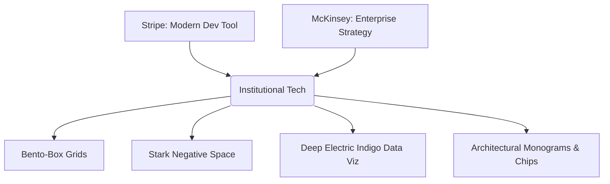

# Brand Analysis: The "Institutional Tech" Direction

> **Slogan / Core Philosophy:** Integrated Creative & Enterprise Infrastructure Operating as One.
> **Visual Synthesis:** Stripe meets McKinsey. Hyper-clean, highly organized, and exuding quiet, unquestionable authority.

---

## 1. Brand Persona & Voice

The brand speaks with **quiet dominance**. It does not scream for attention; it commands it. Its voice is intense, visionary, and hyper-organized. It relies on absolute facts, cold metrics, structural rigidity, and predictive insights.

### Key Vocabulary & Topics
* **Infrastructure**: Foundational, bulletproof, industrial-grade systems.
* **Ecosystems**: Connected networks, systemic flows, market mechanics.
* **Predictive Modeling**: Forward-looking, data-driven foresight, machine-learning certainty.
* **Clarity at Scale**: Cutting through complexity to deliver precise, actionable information.

---

## 2. Visual Style & Aesthetic Pillars

The aesthetic represents a collision between the **developer-centric simplicity of Stripe** and the **high-altitude consulting precision of McKinsey**.

### Pillar I: Bento-Box Grids
Every element belongs to a coordinate. The bento grid enforces structural hierarchy, creating compartmentalized information chunks. There are no loose elements. Information is packaged into clean, glassmorphic or solid containers with razor-thin borders.

### Pillar II: Stark Negative Space
Negative space is treated as an active structural element. It provides breathing room, elevates readability, and reinforces the feeling of premium enterprise software.

### Pillar III: High-Contrast Technical Gradients
Monochromatic tones dominate the interface, broken only by deep electric indigo gradients that suggest flow, data activity, and system health.

---

## 3. The Color Palette

The palette is highly restrained, consisting of four primary colors designed to scale across both Light and Dark modes.

| Color | CSS Variable | Hex Code | Role in Light Mode | Role in Dark Mode |
| :--- | :--- | :--- | :--- | :--- |
| **Stark White** | `--color-stark-white` | `#FFFFFF` | Background Depth / Cards | High-contrast Highlights |
| **Alabaster** | `--color-alabaster` | `#F8F9FA` | Page Body Background | Muted Text / Technical Outlines |
| **Charcoal Slate** | `--color-charcoal-slate` | `#1A202C` | Primary Headings & Borders | Page Background Depth / Dark Cards |
| **Deep Electric Indigo** | `--color-electric-indigo` | `#4F46E5` | Data Viz / Action Items / Gradients | Accent Glow / Hyper Alerts / Gradients |

---

## 4. Typography Blueprint

The typography is divided between institutional authority and technical precision.

* **Headers: Neue Montreal / Helvetica Now**
  * *Characteristics*: Neo-grotesque, clean, established, institutional.
  * *Purpose*: Dominant headings, value propositions, high-level statements.
* **Body / Space / Data: SF Pro / Roboto Mono**
  * *Characteristics*: Monospace for metrics, clean sans-serif for UI labels.
  * *Purpose*: Data readouts, code outputs, UI elements, technical descriptions, label labels.

---

## 5. Data Visualization Guidelines

Data is the ultimate authority. The visualization style avoids childish, over-rounded shapes and focuses on:
1. **Mesh Grids**: Subtle background coordinates that make charts look like blueprints.
2. **Indigo Fills**: Semi-transparent indigo gradients underneath sharp, thin line charts.
3. **Data Spikes**: Small warning indicators or vertical lines pinpointing key data anomalies.
4. **Clean Monospace Labels**: Small, high-contrast text tags aligned with coordinates.

---

## Implementation Map (Grow Eco System)

| Surface | Where the tokens live |
| :--- | :--- |
| Grow hub (marketing + admin) | `Aura/src/app/globals.css` (`--void` = page bg, `--obsidian` = cards, `--cyan` = electric indigo, `--platinum` = charcoal slate) |
| The Grow Engine (web) | `The Grow Engine/apps/web/src/app/globals.css` (`--primary`, `--accent`, `--ring` in HSL) |
| The Growees Producer | `The Growees Producer/src/app/globals.css` (`--color-accent*` in OKLCH) |
| Logo / favicon / OG | `Aura/public/logo.svg`, `Aura/src/app/icon.svg`, `Aura/src/app/opengraph-image.tsx` |
