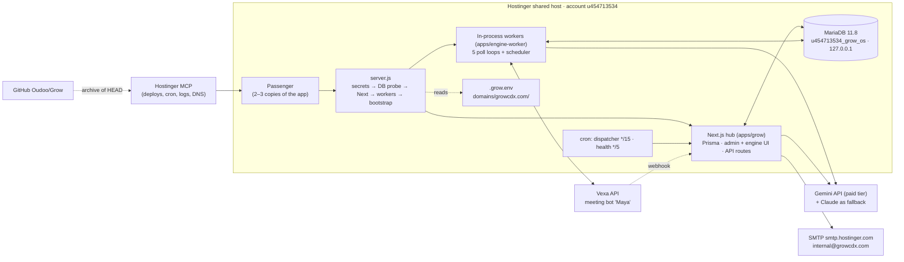
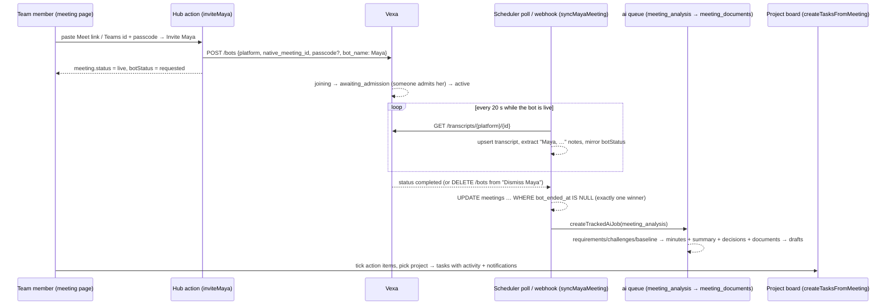

# GROW — Handover of the AI phase (12–16 September 2026)

> **Read this together with [HANDOVER.md](HANDOVER.md)** (the whole system, written 8 September) and
> [DEPLOYMENT.md](DEPLOYMENT.md) (procedures). This document covers what changed between
> 12 and 16 September: the worker outage that was finally explained and fixed, **Maya** the
> meeting agent, the **Developer console**, **Gemini** as the AI provider, and the discovery
> that production runs as several copies of the app. It is written for a developer or an AI
> agent with no memory of these days, and it is deliberately long: every number in it was
> read from the live system or the repository on the date given, not remembered.
>
> **Conventions.** Paths are relative to the repository root. "Hub" = the Next.js app in
> `apps/grow` (Prisma, PascalCase tables such as `Task`). "Engine" = `packages/engine-db`,
> `packages/engine-core`, `apps/engine-worker` (Drizzle, snake_case tables such as
> `queue_jobs`). "A copy" = one Passenger instance of the app. Times are UTC unless noted.
> No secret values appear here; where a value is needed the text says which file or panel
> holds it.

## Table of contents

0. [State at a glance](#0-state-at-a-glance-2026-09-16-0738-utc)
1. [What happened, in order](#1-what-happened-in-order)
2. [Architecture after this phase](#2-architecture-after-this-phase)
3. [Runtime truths you must not forget](#3-runtime-truths-you-must-not-forget)
4. [Queues, workers and the scheduler](#4-queues-workers-and-the-scheduler)
5. [Engine schema migrations — the resumable migrator](#5-engine-schema-migrations--the-resumable-migrator)
6. [The AI provider layer](#6-the-ai-provider-layer)
7. [Maya, the meeting agent](#7-maya-the-meeting-agent)
8. [The Developer console](#8-the-developer-console)
9. [Configuration reference — every `.grow.env` key](#9-configuration-reference--every-growenv-key)
10. [Operations runbook](#10-operations-runbook)
11. [Security and data handling](#11-security-and-data-handling)
12. [Testing and quality gates](#12-testing-and-quality-gates)
13. [Backlog, ranked](#13-backlog-ranked)
14. [Decision log](#14-decision-log)
15. [File index for this phase](#15-file-index-for-this-phase)
16. [Glossary](#16-glossary)

---

## 0. State at a glance (2026-09-16 07:38 UTC)

| Thing | Value |
| --- | --- |
| Live URL | https://growcdx.com |
| Serving | archive deployment **70**, commit `76f1134`, Hostinger build `01a09f5f-27ab-70d0-9fee-29bf381c2d8e`, built 2026-09-14 10:03–10:08 |
| Repository | `github.com/Oudoo/Grow`, branch `main`, HEAD `76f1134`; working tree clean except two unrelated untracked items (`Grow identity hotels/`, `scripts/rebrand_pptx.py`) |
| `/api/health` | `status ok`, `pid 3444233`, `envSource domain`, `envSecondary null`; every key flag **false**: `smtpHost smtpUser smtpPass cronSecret anthropicKey geminiKey maya mayaWebhook` |
| `/api/health/db` | `ok`, host `127.0.0.1`, adminUsers 7, notifications 22, activities 50, settings 1, channels 5, chatMessages 1, **queueJobs 32**, **engineMigrations 5**, outbox 0, 5 ms |
| Runtime log | quiet; the worker error loop stopped on 12 Sep at 11:00:54 and has not written a line since |
| Tests | hub 114 in 11 files (run from `apps/grow`), engine-core 42 in 6 files (run from `packages/engine-core`) |
| Engine migrations | 5 recorded (`0000`–`0004`), all verified at boot |
| Dormant until keys exist | every AI call, Maya, outbound email, the dispatcher's authenticated cron |
| Owner's pending actions | add `GEMINI_API_KEY` (+ `AI_PRIMARY_PROVIDER`, `GEMINI_MODEL`), `VEXA_API_KEY`, `VEXA_WEBHOOK_SECRET`, the SMTP block and `CRON_SECRET` to the domain-level `.grow.env`, restart; register the Vexa webhook; create an external uptime monitor; decide about the 6.7 GB `stderr.log` |
| Hostinger deployments counter | 76 in hPanel — that count includes the failed git-triggered builds; the ones that matter are the archive builds listed in §1 |

---

## 1. What happened, in order

### 1.1 Friday 12 September — the outage that had been running for ten days

**Starting point.** HANDOVER.md §3.2 said five in-process workers were failing a `queue_jobs`
query about seven times a second with the cause "unconfirmed". The runtime log had 5.16
million lines. `/api/health` showed mail unconfigured; §3.1 said the SMTP block "went into
`~/.grow.env`".

**What was actually wrong** (proven, in this order):

1. Production `queue_jobs` had 12 columns. Engine migration `0001` — which adds
   `available_at`, `locked_at`, `locked_by`, `payload`, `max_attempts` and the poll index —
   had never run. The workers' `SELECT … FOR UPDATE SKIP LOCKED` names `available_at`, so
   every poll failed.
2. `__drizzle_migrations` was **empty** while 90 engine tables existed.
3. Statement **244 of 262** in migration `0000` is `CREATE INDEX cost_tracking_feature_idx ON
   cost_tracking (tenant_id, feature)`, and `feature` was a `TEXT` column. MariaDB 11.8
   refuses that with `ER_TOO_LONG_KEY (1071): Specified key was too long; max key length is
   3072 bytes`. drizzle-orm's migrator records a migration only after *all* its statements
   succeed, and MySQL DDL auto-commits, so 243 statements stayed applied-but-unrecorded.
   Every boot re-ran statement 1, hit "table already exists", stopped — and the old
   `migrate-engine.mjs` swallowed the error. The same failure reproduced on the local
   `grow_local` database at the same statement, which is how it was proven rather than
   inferred. Both databases were also missing the 19 indexes that follow statement 244.

**Fixes shipped as deployment 66 (commit `9d3251c`, live 11:08):**

- `cost_tracking.feature` narrowed to `varchar(191)`; migration `0002` written; migration
  `0000` amended in place to narrow the column before that index (legitimate only because
  no database had ever recorded `0000`; the amendment says so in the SQL file).
- `apps/grow/scripts/migrate-engine.mjs` rewritten as a resumable, statement-by-statement
  runner (§5) with `apps/grow/scripts/lib/engine-migrations.mjs` + 9 unit tests.
- Production migrated **from a laptop before the deploy**, through a temporary MySQL remote
  grant for the laptop's IP (created and removed with the Hostinger MCP): `0000` → 20
  statements applied / 243 already in place; `0001` → 6 applied; `0002` → 1 applied. The
  error loop stopped the instant the columns existed: zero log lines after 11:00:54.
- Poll loop backoff (idle and failing), wake-on-enqueue, cause-first error lines, a schema
  gate before workers start (§4).
- `/api/health/db` gained `queueJobs`, `engineMigrations`, `outbox`.
- `server.js` and `start.mjs` read **both** `.grow.env` copies (nearest authoritative, the
  other fills gaps) and `/api/health` reports `envSecondary` + `envSecondaryKeys`.
- The 22 notification emails queued since 31 August were retired (`emailedAt` set,
  `emailError` explains and gives the reversal SQL) so the first live dispatch would not send
  ten-day-old mail. In-app copies untouched.
- `scripts/mcp/hostinger-mcp.sh` + `setup-hostinger.sh`: Keychain-backed Hostinger MCP
  launcher (the token stops living in `~/.claude.json`).

**Findings on the host the same day** (through the cron-job shell trick, §3.6):

- `nodejs/stderr.log` is **6.7 GB** — where the worker errors went. `console.log` is 1 MB,
  `hbuilds` 2.3 GB, `public_html` 444 KB. The file was **not** deleted; the command to
  reclaim it is in §10.
- The **only** `.grow.env` on the whole account is
  `/home/u454713534/domains/growcdx.com/.grow.env`, 265 bytes, last modified **5 July**. It
  holds exactly `DATABASE_URL NODE_ENV AUTH_SECRET ADMIN_EMAIL ADMIN_PASSWORD STAFF_PASSWORD`.
  `~/.grow.env` does not exist; nor does one in `public_html/` or `nodejs/`. The SMTP block
  was never written anywhere on the host. HANDOVER §3.1 was corrected (commits `0822aaf`,
  `1ab0bb6`).

**Deployment 67 (commit `f3003ee`, live 12:07): Maya** — §7.

### 1.2 Sunday 14 September

- **Deployment 68 (commit `3be4474`, live 2026-09-13 21:54 UTC): the Developer console** — §8.
  Its build log exposed a second `spawn … EAGAIN` boot and four "daily AI jobs skipped" lines
  minutes apart — the multi-copy discovery.
- **Deployment 69 (commit `fdabefa`, live 10:00): Gemini as a provider** — §6.
- **Deployment 70 (commit `76f1134`, live 10:08): multi-copy fixes** — database-backed
  scheduler and bootstrap locks, atomic Maya hand-off, spawn retry, `pid` in health — §3.1.

### 1.3 Numbers the phase left behind

| Metric | Before (12 Sep 10:36) | After (16 Sep 07:38) |
| --- | --- | --- |
| Worker poll failures | ~7 per second, 5 workers | 0 |
| Runtime log lines | 5,152,590 | 55–120 per boot |
| Engine migrations recorded | 0 | 5 |
| `queue_jobs` columns | 12 | 17 |
| Notification outbox | 22 stale rows | 0 |
| Hub tests | 103 | 114 |
| Engine-core tests | 0 (no runner) | 42 |
| Archive deployments | 65 | 70 |

---

## 2. Architecture after this phase



**How a request flows.** Passenger accepts the connection and hands it to one of its copies of
`server.js`. `server.js` serves Next in-process (it must never spawn `next start`; Passenger
owns the socket). Everything the hub renders reads MariaDB over loopback through Prisma; the
engine pages read the same database through Drizzle.

**How background work flows.** Anything heavy is a row in `queue_jobs`. Every copy of the
app runs five poll loops (`integration`, `ai`, `research`, `notification`, `events`) that
claim rows with `SELECT … FOR UPDATE SKIP LOCKED`, so several copies cannot run the same job.
The scheduler in every copy wakes on timers, but only the copy that wins a **database lock**
does the tick's work (§4.4).

**How Maya flows.** The hub asks Vexa to send a bot; the scheduler polls Vexa's transcript
every 20 s (Vexa's webhook does the same sooner); when the bot leaves, the meeting is handed
to the `ai` queue exactly once; the analysis writes minutes, documents and proposed tasks;
a person approves the tasks into the board (§7).

**Two ORMs, one database.** Hub tables are Prisma's (`AdminUser`, `Task`, `Notification`,
`SystemSetting`, …). Engine tables are Drizzle's (`meetings`, `queue_jobs`, `ai_jobs`,
`cost_tracking`, `scheduler_locks`, …). They share one MariaDB schema and one connection
host. The engine reads one hub table by raw SQL: `SystemSetting`, for the developer flags.

---

## 3. Runtime truths you must not forget

### 3.1 The app runs as several copies

**Evidence.** The runtime log after deployment 68 shows two complete boots interleaving twelve
seconds apart — two "Loaded persistent secrets", two "Next.js listening", two sets of
"[worker:*] started", two bootstraps — and at 23:36 that night a third copy started under
load (its bootstrap failed with `EAGAIN`, see below). Each copy later logged its own
"daily AI jobs skipped" line 15 minutes after its own start. Passenger spawns instances on
demand; you do not control how many.

**Consequences, and what was done about each (deployment 70):**

| Assumption that broke | Fix |
| --- | --- |
| Scheduler lock lived in the in-memory "redis" store (`packages/engine-core/src/redis.ts`), which is per process → every copy ran the daily tick | Locks are rows in `scheduler_locks` (migration `0004`); `withDbLock()` in `packages/engine-core/src/locks.ts`; in-memory fallback only if the database is unreachable |
| Maya's meeting-ended hand-off was read-then-write → two copies could both queue the analysis | Conditional `UPDATE … WHERE bot_ended_at IS NULL`; only the copy whose update changed a row queues |
| Every copy ran the six bootstrap child processes at once → host process limit → `spawn … EAGAIN` on 12 Sep 19:04 and 13 Sep 23:37, every step "could not run" | One copy takes a 10-minute `bootstrap` lock (same table, created on the spot if migration `0004` has not run yet); others log "another copy of the app is bootstrapping (pid N skips)"; refused spawns (`EAGAIN`, `EMFILE`, `ENOMEM`) retry up to 5 times, 3 s × attempt apart |
| Nothing showed how many copies serve | `/api/health` returns `pid`; call it a few times |

**Rules that follow.** Never add a process-local lock, cache or counter that must be
exclusive or exact. The developer-flags cache (15 s, per copy) is fine because it only
needs to be eventually consistent. Wake-on-enqueue only wakes loops in the same copy; other
copies pick the job up on their idle interval (≤ 15 s). Poll loops are safe by design.

### 3.2 Configuration is one file, and it is the domain-level one

- Path: `/home/u454713534/domains/growcdx.com/.grow.env`. It is the **only** copy on the
  account (verified 12 Sep with `ls -la` on the four plausible locations). It is one
  directory **above** `public_html`; hPanel's File Manager opens inside `public_html`, and a
  file created there is never read.
- `server.js` loads the nearest `.grow.env` walking up from the app directory with
  `override: true` (it must beat anything the host injects), then, if a **different** copy
  exists in the account home, loads it with fill-only semantics and records which keys it
  contributed. `/api/health` reports `envSource` (`domain` / `home` / `other`) and
  `envSecondary` + `envSecondaryKeys` (well-known key **names** only).
- hPanel → Node.js → Environment variables is **build-time only**. Proven 2 Sep; do not use it
  for runtime values.
- A change to `.grow.env` needs a Node app restart (hPanel, or `hosting_restartNode_jsApplicationV1`
  with `username: "u454713534"`).

### 3.3 Database

- The app connects over **`127.0.0.1`**. `localhost` fails with `ER_ACCESS_DENIED_ERROR`
  (per-host MySQL accounts); `server.js` probes `localhost`, `127.0.0.1`, then
  `srv1808.hstgr.io` at boot and uses the first that answers `SELECT 1`. The probe is
  one-shot and boot-time by design — never add runtime reconnect logic (HANDOVER §11.1).
- Remote grants on `u454713534_grow_os` (as of 12 Sep): `2.57.91.212` and
  `2a02:4780:3f:1234::39`. To work from a laptop: `hosting_createDatabaseRemoteConnectionV1`
  (`username: "u454713534"`, `name: "u454713534_grow_os"`, `ip: <your public IPv4>`), connect
  with the credentials from the gitignored `apps/grow/.env` and host `srv1808.hstgr.io`, and
  remove the grant afterwards with `hosting_deleteDatabaseRemoteConnectionV1`. It takes
  effect within seconds. This is exactly how production was migrated on 12 Sep.
- MariaDB returns `json()` columns as **strings**. Hub: `lib/engine/json.ts` (`jsonArray`,
  `jsonObject`). Engine: `jsonArrayFrom()` in `packages/engine-core/src/meetings/vexa.ts`.

### 3.4 Boot sequence, and the log lines to expect

`server.js` (Passenger's startup file, at the repo root) does, in order:

1. `chdir(apps/grow)` — Prisma finds its engine relative to cwd.
2. Load `.grow.env` (primary, then secondary) → `[server] Loaded persistent secrets from … (authoritative)`.
3. Probe database hosts → `[server] database host localhost unusable: ER_ACCESS_DENIED_ERROR`,
   `[server] database host: 127.0.0.1 (probed OK)`.
4. Ensure `AUTH_SECRET` (generates and appends one if missing).
5. Prepare Next and listen → `[server] Next.js listening on 3000 (dir: …/hbuilds/versions/<build>/nodejs/apps/grow)`.
6. Next's `instrumentation.ts` starts the in-process workers → `[worker:<name>] started (in-process)` × 5,
   `[scheduler] started (in-process)`. Workers first wait for the queue schema (§4.3).
7. Five seconds later, **bootstrap**: `claimBootstrapLock()`; the loser logs
   `[bootstrap] another copy of the app is bootstrapping (pid N skips).` The winner runs, in
   order: `hub schema` (`migrate-hub.mjs`), `schema sync (prisma db push)` — which fails with
   `spawn …/.bin/prisma EACCES` on this host and is harmless —, `engine schema`
   (`migrate-engine.mjs`), `staff IAM accounts`, `link task owners`, `client knowledge bases`,
   `system configuration`, then `[bootstrap] Done.` Every outcome goes to **stdout**.

A refused spawn now logs `could not run (EAGAIN) — retrying in 3s (attempt 2/5)`.

### 3.5 Health endpoints — every field

`GET /api/health` — dependency-free liveness; never touches the database. Fields:

| Field | Meaning |
| --- | --- |
| `status`, `service`, `time` | constant `ok` / `grow-hub` / server clock |
| `pid` | process id of the copy that answered |
| `config.authSecret`, `databaseUrl` | presence of the two values without which login fails |
| `config.nodeEnv` | `production` on the host |
| `config.smtpHost`, `smtpUser`, `smtpPass`, `cronSecret` | presence of the mail block and the dispatcher secret |
| `config.anthropicKey`, `geminiKey` | presence of AI keys |
| `config.maya`, `mayaWebhook` | presence of `VEXA_API_KEY`, `VEXA_WEBHOOK_SECRET` |
| `config.envSource` | which `.grow.env` was authoritative: `domain`, `home`, `other`, or `null` |
| `config.envSecondary`, `envSecondaryKeys` | the other copy, and the well-known keys it filled |

`GET /api/health/db` — the load-bearing probe; **returns 503 when the database is
unreachable**, so uptime monitors must point here:

| Field | Meaning |
| --- | --- |
| `ok`, `ms` | one `AdminUser.count()` round-trip succeeded, and how long it took |
| `host` | hostname in the effective `DATABASE_URL` — must be `127.0.0.1` |
| `adminUsers`, `notifications`, `activities`, `settings`, `channels`, `chatMessages` | hub table counts; a missing table reads `table-missing — boot migration did not run` |
| `queueJobs` | `COUNT(available_at)` on `queue_jobs` — proves the table **and** the column migration `0001` added |
| `engineMigrations` | rows in `__drizzle_migrations`; expect **5** |
| `outbox` | notifications queued for email and still eligible (`emailedAt null`, `emailAttempts < 3`) |

On failure it adds `name`, `code`, `datasource` (credentials redacted), `cwd` and the
generated-Prisma-client directory listing.

### 3.6 Logs, and the shell you do have

- **Runtime log** (`hosting_getNode_jsRuntimeLogsV1`, `username: "u454713534"`): a
  **per-version** file that resets on every deploy. With `period` it returns HTTP 500 when
  the file is huge; `from_line: <n>` (no `period`) always works and returns the newest
  entries plus `total_lines` — poll with `total_lines + 1`.
- **`nodejs/stderr.log`** (6.7 GB) is the *old* Passenger app root's stderr; deploys do not
  touch it. It is the retired error loop. Reclaim command in §10.9.
- **Build log** (`hosting_showJsDeploymentLogs`, `buildUuid`): contains Next's route table —
  the way to prove a page shipped (`ƒ /admin/developer`).
- **There is no SSH**, and the account's file-listing endpoint stops at `public_html`. A
  **temporary cron job is a shell**: `hosting_createAccountCronJobV1` (`* * * * *`), wait
  60–90 s, `hosting_getCronJobOutputV1`, then `hosting_deleteAccountCronJobV1`. Quirks, all
  confirmed: command ≤ **255 characters**; the captured output is the **last command's
  stdout only** (one plain pipeline per job — `( … )` subshells produced nothing twice);
  `$vars`, `$1`, `%` and `~` are mangled before the shell runs; `\n` loses its backslash;
  use absolute paths and `paste -sd ' ' -` to join lines; there is **no `node`** in cron's
  PATH. Read-only by default; never blind-overwrite `.grow.env`.

### 3.7 Deploying — archive only

```bash
# from the repo root, on a clean committed tree
S=/tmp/grow-deploy && rm -rf $S/pkg $S/grow-deployN.zip && mkdir -p $S/pkg
git archive HEAD | tar -x -C $S/pkg
rm -rf $S/pkg/Fonts $S/pkg/docs "$S/pkg/apps/grow/User Assets" $S/pkg/apps/engine-web $S/pkg/apps/producer
(cd $S/pkg && zip -rq $S/grow-deployN.zip . -x '*.DS_Store')     # ~9 MB
```

Then `hosting_deployJsApplication` with `domain: growcdx.com`, `archivePath: <zip>`. It
resolves `app_type: other`, `entry_file: server.js`, builds on the host (`npm run build`,
about 3 minutes), then Passenger restarts onto `hbuilds/versions/<uuid>/nodejs`.

- **Every `git push` to `main` also triggers a Hostinger git build**, which fails its
  Next-standalone validator 2–3 minutes later and changes nothing — but it **queues ahead of
  an archive build** started after it, adding those minutes. Push after deploying, or turn
  off auto-deploy in hPanel → Git.
- Verify (§10.2) before believing a deploy: `/api/health` (a new field or the `pid`
  changing), `/api/health/db`, the runtime log's first 30 lines, and the 200/307 sweep.
- Rollback: build the archive from the previous commit (`git archive <hash>`) and deploy it
  the same way. The database migrations are additive, so an older build runs on a newer schema.

---

## 4. Queues, workers and the scheduler

### 4.1 Tables

**`queue_jobs`** (engine, 17 columns after migration `0001`): `id`, `tenant_id`,
`queue_name` (`integration` · `ai` · `research` · `notification` · `events`), `job_name`,
`bull_job_id` (self-reference, historical), `status` (`waiting` → `active` → `completed` |
`failed`), `payload_summary`, `payload` (the full job data), `error`, `attempts`,
`max_attempts` (default 3), `duration_ms`, `available_at` (delay + backoff), `locked_at`,
`locked_by` (`<queue>:<8 hex>` of the claiming loop), `enqueued_at`, `finished_at`. Indexes:
`(queue_name, status)`, `(bull_job_id)`, `(status, available_at)`.

**`ai_jobs`** (engine): the tracked record for AI work — `job_type`, `status` (`queued` →
`running` → `completed` | `failed` | **`skipped`**, the last one new this phase), `input`,
`output`, `queue_job_id`, `error`, `attempts`, timestamps. `createTrackedAiJob()` in
`packages/engine-core/src/jobs.ts` inserts the row and enqueues the queue job carrying its id;
the hub's `lib/engine/jobs.ts` re-exports it as `createAiJob`.

**`cost_tracking`** and **`usage_records`**: one row per AI call (provider, model, feature,
tokens in/out, USD). The Developer console's "AI spend, 30 d" tile and the engine's Costs page
read these. `cost_tracking.feature` is `varchar(191)` since migration `0002`.

**`scheduler_locks`** (migration `0004`): `lock_key` (PK), `owner` (`hostname:pid`),
`expires_at`, `created_at`. Rows are the locks (§4.4).

### 4.2 The poll loop (`createPollWorker` in `packages/engine-core/src/queues.ts`)

Each loop, per iteration:

1. Reads the developer flags (15 s cache). If `workers.paused` is on, sleeps 5 s and loops —
   the loop stays alive, claims nothing, queued work waits.
2. `claimNextJob()`: a transaction doing `SELECT … WHERE queue_name IN (?) AND status =
   'waiting' AND available_at <= NOW() ORDER BY available_at, enqueued_at LIMIT 1 FOR UPDATE
   SKIP LOCKED`, then marks the row `active` with `locked_at`/`locked_by` and `attempts + 1`.
3. **No job:** sleeps the idle interval, which starts at 1.5 s and grows ×1.5 per empty poll
   up to 15 s, then resets on the next job. `enqueue()` **wakes** the loop for that queue
   in the same copy immediately (a delayed job does not wake it).
4. **Claim threw:** counts consecutive failures, waits `1.5 s × 2^min(n,12)` capped at 60 s,
   and reports the failure once, then at most once a minute. The reported line is built
   cause-first — `claim failed 3× in a row — ER_BAD_FIELD_ERROR: Unknown column
   'available_at' … — next poll in 12s` — because drizzle's own message is "Failed query:
   <the entire SQL>" with the real error hidden in `cause`. When a claim succeeds after
   failures it emits `recovered`, which `start.ts` logs.
5. **Job claimed:** runs the processor; `completeJob()` on success; `failJob()` on error —
   requeue with backoff `5 s × 2^(attempt-1)` capped at 5 min while attempts remain, else
   park as `failed`. With `debug.logging` on, claim / complete / fail are each logged.

### 4.3 The schema gate (`apps/engine-worker/src/start.ts`)

`startInProcessWorkers()` no longer starts the loops directly. It calls `isQueueSchemaReady()`
— `SELECT available_at, locked_by, payload, max_attempts FROM queue_jobs LIMIT 0` — and only
when that succeeds creates the five workers and the scheduler. Until then it re-checks every
30 s and logs on the first miss and every tenth. Reason: instrumentation runs **before** the
bootstrap that applies migrations, so on a fresh or repaired database the schema lands after
the loops would otherwise have started; this is exactly how five loops spun for ten days.

### 4.4 The scheduler (`apps/engine-worker/src/scheduler.ts`)

| Tick | Interval | Lock key · TTL | What it does |
| --- | --- | --- | --- |
| Integration syncs | 5 min | `scheduler:due_syncs` · 240 s | enqueues `sync` for connected integrations whose frequency elapsed |
| Token refresh | 60 min | `scheduler:token_refresh` · 3500 s | enqueues `refresh_token` + a `token_expiring` event for tokens expiring within 72 h |
| Daily jobs | checked every 15 min | `scheduler:daily:<UTC date>` · 86 400 s | per active tenant: `retention_enforcement`, `process_intelligence`, `health_score` per active client; `digest_weekly` on Mondays; `digest_monthly` + `scorecards` on the 1st |
| Maya poll | 20 s (only if `VEXA_API_KEY`) | `scheduler:maya_poll` · 15 s | `pollMayaMeetings()` — §7.5 |

Rules added this phase:

- Every tick runs inside `withDbLock()` — the copy that wins the row does the work. `withLock`
  in the scheduler is now a thin wrapper over it.
- The first three ticks are skipped when the console flag `scheduler.enabled` is off. Maya's
  poll is deliberately exempt: a meeting in progress keeps syncing whatever the owner pauses.
- The daily tick returns early with `[scheduler] daily AI jobs skipped — AI is not configured
  or is switched off.` when no provider key exists or `ai.enabled` is off. Before this guard,
  32 doomed AI jobs accumulated in two days (they are the `queueJobs: 32` still visible; the
  console's "Purge finished queue rows" removes finished rows older than a day).

`withDbLock(key, ttl, fn)` in `packages/engine-core/src/locks.ts`: sweeps expired rows, then
`INSERT`s the key with `owner = hostname:pid` and `expires_at = now + ttl`. Duplicate key
(`errno 1062`) = someone else holds it → skip. Any other error (table not yet created, DB
down) falls back to the in-memory lock so scheduled work never stops because of the lock
itself. The lock is **held for the TTL**, not released after `fn` — that is what makes
"once per day" mean once across all copies. `listDbLocks()` exists for the console (not yet
surfaced there).

### 4.5 What the AI worker does with a disabled or unconfigured provider

`apps/engine-worker/src/workers/ai/index.ts` dispatches by `job_type`. If the provider layer
throws `AiDisabledError` (console flag `ai.enabled` off), the job is marked **`skipped`** in
`ai_jobs` and the queue row **completes** — no retries, nothing billed. If no provider key
exists at all, `aiComplete` throws "No AI provider configured…", the job fails, retries three
times with backoff, and parks as `failed`; the console's "Re-queue failed AI jobs" brings the
newest 50 failed/skipped back once a key exists.

---

## 5. Engine schema migrations — the resumable migrator

### 5.1 Where things live

| Path | Role |
| --- | --- |
| `packages/engine-db/src/schema/*.ts` | the Drizzle schema (source of truth for types) |
| `packages/engine-db/drizzle/` | generated migrations: `NNNN_<tag>.sql`, `meta/_journal.json`, `meta/NNNN_snapshot.json` |
| `apps/grow/drizzle-engine/` | a **byte-identical copy** of the folder above, because the deployed app's boot script reads it from `apps/grow` — `diff -rq` must be empty |
| `apps/grow/scripts/migrate-engine.mjs` | the runner (boot step "engine schema"; also runs by hand) |
| `apps/grow/scripts/lib/engine-migrations.mjs` (+ `.test.mjs`) | the pure logic: read journal, split statements, classify errors, apply, record |
| `__drizzle_migrations` (table) | drizzle's own bookkeeping: `id`, `hash` (sha256 of the file), `created_at` (= journal `when`) |

### 5.2 How the runner works

1. Reads the journal, splits each file on `--> statement-breakpoint` exactly as drizzle does,
   hashes the whole file with sha256.
2. Reads `MAX(created_at)` from `__drizzle_migrations` (creating the table if needed, with
   drizzle's own DDL). A migration is pending while its `when` is greater than that.
3. Applies a pending migration **one statement at a time**, in autocommit. An error whose
   MySQL number says the object already exists is an outcome, not a failure:
   `1050` table exists · `1060` duplicate column · `1061` duplicate key name · `1826` duplicate
   FK name · `1091` already dropped · `1005` with `errno 121` (MariaDB's spelling of a duplicate
   FK). Anything else **stops the run**: it prints `FAILED: <tag> statement i/n failed —
   <code>: <message>` and the statement text to **stdout**, exits **1**, and records nothing
   for that migration — so the next run resumes at the same place.
4. After each migration's statements are all in place it inserts the bookkeeping row with
   drizzle's hash and `when`, so drizzle-kit and `migrate()` agree with it.
5. Finally verifies that `queue_jobs` has `available_at`, `locked_by`, `payload`,
   `max_attempts` and prints `verified: queue_jobs has its polling columns; in-process workers
   can run.` Exit 0 only then.

Run by hand from a laptop (host rewritten, see §3.3):
`cd apps/grow && DATABASE_URL="mysql://…@srv1808.hstgr.io:3306/u454713534_grow_os" node scripts/migrate-engine.mjs`.
Against the local database: `DATABASE_URL="<grow_local url>" node scripts/migrate-engine.mjs`.
Both are idempotent; a second run prints `engine schema up to date (N migration(s) recorded)`.

### 5.3 The migrations, and what each contains

| # | Tag | `when` | Content |
| --- | --- | --- | --- |
| 0000 | `watery_mandrill` | 1782313140403 | 63 tables, 131 FK `ALTER`s, 68 indexes — the whole engine. **Amended 2026-09-12**: an `ALTER TABLE cost_tracking MODIFY COLUMN feature varchar(191) NOT NULL` inserted before the `cost_tracking_feature_idx` index (statement 244), with a comment explaining why; legitimate because no database had ever recorded 0000 |
| 0001 | `majestic_nico_minoru` | 1782622463017 | `queue_jobs` + `payload`, `max_attempts`, `available_at`, `locked_at`, `locked_by`; index `queue_jobs_poll_idx (status, available_at)` |
| 0002 | `cost_tracking_feature_varchar` | 1789210741029 | `cost_tracking.feature` → `varchar(191)` (repeats the amendment for the snapshot's sake) |
| 0003 | `maya_meeting_agent` | 1789213836216 | `meetings` + `meeting_url`, `bot_platform`, `bot_meeting_id`, `bot_status`, `bot_requested_at`, `bot_ended_at`, `live_notes` (json), `minutes_markdown`, `summary`, `mentioned_documents` (json); index `meetings_bot_idx (bot_platform, bot_meeting_id)` |
| 0004 | `scheduler_locks` | 1789379923975 | table `scheduler_locks` (`lock_key` PK, `owner`, `expires_at`, `created_at`) |

Production state on 16 Sep: 5 rows in `__drizzle_migrations`; `/api/health/db` →
`engineMigrations: 5`.

### 5.4 Adding an engine migration

```bash
# 1. edit packages/engine-db/src/schema/<file>.ts
# 2. generate (drizzle-kit refuses an absolute --out; stay relative)
cd packages/engine-db
npx drizzle-kit generate --dialect mysql --schema ./src/schema/index.ts --out ./drizzle --name <short_tag>
# 3. mirror the folder the deployed app reads
rm -rf ../../apps/grow/drizzle-engine && cp -r drizzle ../../apps/grow/drizzle-engine
diff -rq drizzle ../../apps/grow/drizzle-engine            # must print nothing
# 4. rehearse on the local database, twice (second run must be a no-op)
cd ../../apps/grow && DATABASE_URL="<grow_local url>" node scripts/migrate-engine.mjs
# 5. rebuild the db package so engine-core compiles against the new columns
npm run build --workspace=@growengine/db
# 6. deploy; then /api/health/db engineMigrations must read one higher, and the boot log
#    must show "[migrate-engine] NNNN_<tag>: k statement(s) applied … — recorded"
```

Additive only, always. A destructive statement here runs unattended against production on
every boot.

### 5.5 The hub side, unchanged in spirit

Hub DDL still lives in `apps/grow/scripts/migrate-hub.mjs` (idempotent `information_schema`
checks) because `prisma db push` cannot run on this host — the boot log now shows the concrete
reason: `spawn …/node_modules/.bin/prisma EACCES` (the shim is not executable after an archive
deploy). The step is left in as a harmless probe. Every new hub table gets a count in
`/api/health/db`.

---

## 6. The AI provider layer

### 6.1 Files

| File | Responsibility |
| --- | --- |
| `packages/engine-core/src/ai/select.ts` (+ `select.test.ts`, 7 tests) | the pure routing rule: `chooseAi()`, `modelFamily()`, `fallbackOrder()`, `PROVIDER_ORDER` |
| `packages/engine-core/src/ai/provider.ts` | clients for Anthropic, Gemini, OpenAI; `aiComplete`, `aiCompleteJson`, `aiCompleteStructured`, `resolveAi`, `providerKeys`, `isAiConfigured`, `recordAiCost`, `AiDisabledError`, the `PRICING` table |
| `packages/engine-core/src/ai/embeddings.ts` | `embedTexts` (Gemini or OpenAI), `activeEmbeddingModel`, `chunkText` |
| `packages/engine-core/src/aom.ts` | records `activeEmbeddingModel().model` on every stored vector |
| `packages/engine-core/src/env.ts` | the env keys below |
| `packages/engine-core/src/dev-flags.ts` | `ai.enabled`, `ai.model` |

### 6.2 The routing rule (`chooseAi`)

1. If the console's `ai.model` override is set and its **family** has a key, use that model
   (`claude-*` → Anthropic, `gemini-*` → Gemini, `gpt-*`/`o*` → OpenAI).
2. Else `AI_PRIMARY_PROVIDER`, if it has a key.
3. Else the first provider with a key in the order Anthropic, Gemini, OpenAI.
4. Nothing configured → a clear error, never a silent default.

A **forced** provider (`opts.provider`, used by the console's probes) skips 1–3 and fails
rather than answering from another provider. `aiComplete` (not the structured variant) fails
over to the other configured providers in canonical order when the chosen one throws — unless
a provider was forced. Examples:

| Keys present | Flag `ai.model` | `AI_PRIMARY_PROVIDER` | Result |
| --- | --- | --- | --- |
| Gemini only | (empty) | `anthropic` | Gemini, `GEMINI_MODEL` |
| Gemini + Anthropic | (empty) | `gemini` | Gemini |
| Gemini + Anthropic | `claude-sonnet-5` | `gemini` | Anthropic, `claude-sonnet-5` |
| Anthropic only | `gemini-3.8-flash` | `anthropic` | Anthropic (override ignored: no Gemini key) |
| none | any | any | error "No AI provider configured (set GEMINI_API_KEY, ANTHROPIC_API_KEY or OPENAI_API_KEY)" |

### 6.3 Environment keys

| Key | Default | Notes |
| --- | --- | --- |
| `GEMINI_API_KEY` (or `GOOGLE_API_KEY`) | — | AI Studio key on a **paid** project (§6.7) |
| `AI_PRIMARY_PROVIDER` | `anthropic` | set `gemini` per the 14 Sep decision |
| `GEMINI_MODEL` | `gemini-2.5-pro` | `gemini-3.8-flash` / `gemini-2.5-flash` are cheaper |
| `GEMINI_EMBEDDING_MODEL` | `gemini-embedding-001` | truncated to 1536 dimensions |
| `ANTHROPIC_API_KEY`, `ANTHROPIC_MODEL` | — / `claude-opus-5` | Console key, pay-as-you-go |
| `OPENAI_API_KEY`, `OPENAI_MODEL`, `EMBEDDING_MODEL` | — / `gpt-4o` / `text-embedding-3-small` | legacy path, still works |

### 6.4 Models and prices in the cost table (USD per 1M tokens, paid tiers)

| Model | Input | Output | Note |
| --- | --- | --- | --- |
| `gemini-2.5-pro` | 1.25 | 10 | default; prompts ≤ 200k |
| `gemini-3.1-pro-preview` | 2 | 12 | preview |
| `gemini-3.8-flash` / `gemini-3.7-flash` | 0.75 | 3.75 | |
| `gemini-2.5-flash` | 0.30 | 2.50 | |
| `gemini-2.5-flash-lite` | 0.10 | 0.40 | |
| `gemini-embedding-2` / `-001` | 0.20 | 0 | `-001` assumed equal to `-2`, not on the pricing page |
| `claude-opus-5` | 5 | 25 | |
| `claude-sonnet-5` | 2 | 10 | |
| `claude-haiku-4-5` | 1 | 5 | |
| `gpt-4o` / `gpt-4o-mini` | 2.5 / 0.15 | 10 / 0.6 | |

An unknown model is costed at 3 / 15. Keep this table current when you change models. For an
hour-long meeting (≈ 25k in / 6k out): Gemini 2.5 Flash ≈ $0.02, 2.5 Pro ≈ $0.09, Claude Sonnet
5 ≈ $0.11, Opus 5 ≈ $0.28. Gemini bot time via Vexa is separate ($0.30/h hosted).

### 6.5 Provider specifics

**Gemini** (`@google/genai` 2.22, `new GoogleGenAI({ apiKey })`): `ai.models.generateContent({
model, contents, config: { systemInstruction, maxOutputTokens (16000 default), temperature
(0.2), responseMimeType: "application/json" when JSON is wanted, responseJsonSchema } })`.
Cost uses `usageMetadata.promptTokenCount` in and `candidatesTokenCount + thoughtsTokenCount`
out (thinking is billed as output). `response.text` is `undefined` when the model returned
no text (safety block, or `MAX_TOKENS` spent on thinking) — that raises `Gemini returned no
text (<finishReason>)` rather than returning an empty string.

**Anthropic** (`@anthropic-ai/sdk` 0.125): `temperature` is **not** sent — Claude Opus 5 /
Sonnet 5 reject sampling parameters with a 400. `stop_reason: "refusal"` raises with the
`stop_details.category`. `max_tokens` default 16000.

**OpenAI**: unchanged chat-completions path with `response_format: json_object` for JSON.

### 6.6 Structured output — three paths, one guarantee

`aiCompleteStructured(schema, prompt, ctx, opts)` takes a **zod v4** schema (`import { z } from
"zod/v4"`; the Anthropic helper's types require v4, and zod 3.25 ships both APIs):

- Anthropic: `client.messages.parse` with `output_config.format: zodOutputFormat(schema)`;
  returns `parsed_output`.
- Gemini: `z.toJSONSchema(schema)` minus its `$schema` key → `responseJsonSchema`; the schema
  emitted for the minutes uses only `type, properties, required, items, enum, description,
  additionalProperties`, all documented as supported; the text is `JSON.parse`d and then
  `schema.parse`d.
- OpenAI: JSON mode, then `schema.parse`.

Every path ends in a zod parse, so callers get exactly the type they asked for or an error.

### 6.7 Embeddings

`activeEmbeddingModel()` → Gemini when `AI_PRIMARY_PROVIDER=gemini` **or** when Gemini is the
only key; else OpenAI. Gemini vectors are requested with `outputDimensionality: 1536` so the
AOM column keeps one shape. **Embedding spaces are not interchangeable**: a corpus embedded
with one model must be searched with the same model. `aom_embeddings.embedding_model` records
the producer of each vector. Production had **no** vectors before 14 Sep, so the switch cost
nothing; if the provider changes again, re-index (delete the rows and let `indexEntity` run).

### 6.8 Policy — what may and may not pay for these calls

- **Claude subscription (Pro/Max):** may not back a product's calls. Anthropic's Claude Code
  legal page: OAuth is "designed to support ordinary use of Claude Code and other native
  Anthropic applications"; developers "including those using the Agent SDK, should use API
  key authentication"; Anthropic "does not permit … routing requests through Free, Pro, or
  Max plan credentials on behalf of their users".
- **Google AI Pro subscription:** grants no Gemini API quota; its developer tools (Gemini CLI
  1,500 requests/day, Antigravity, Jules) are "recommended for individual developers". What it
  does grant is **Google Developer Program Premium with a monthly Google Cloud credit** ($10 on
  the Program's page for AI Pro, $40 on the AI Pro plan page — the owner's account decides),
  which funds the Gemini API's **paid** tier.
- **Gemini free tier is not acceptable for client data:** Google's terms say content on unpaid
  services is used "to provide, improve, and develop Google products" and "human reviewers may
  read, annotate, and process" it. Paid tier: "Google doesn't use your prompts … or responses
  to improve our products." Upgrading needs a linked Cloud Billing account and a **$5 minimum
  prepayment**; prepaid credits must exist before Cloud credits apply to the Gemini API.
- Key acquisition, step by step: DEPLOYMENT.md → "Maya" → "Getting the Gemini key".

### 6.9 Adding another provider

Add the key to `env.ts`; add the family prefix in `select.ts` and a `PROVIDER_ORDER` entry;
add a client and a `completeWith<X>` in `provider.ts` plus a branch in `runProvider` and in
`aiCompleteStructured`; add pricing rows; add the key to `providerKeys()`; add the model names
to `dev-flags.ts` `ai.model.options`; add a presence dot on the Developer console and a probe
button; add the flag to `/api/health`. Tests for the selector are in `select.test.ts`.

---

## 7. Maya, the meeting agent

### 7.1 What she is, in one paragraph

Maya is a participant named "Maya" that joins a **Google Meet** or **Microsoft Teams** call
when someone on the team invites her from a meeting's page, transcribes it with speaker names,
keeps anything said to her by name, and after the call writes the minutes, a summary, the
decisions with evidence, and drafts of every document that was promised — then proposes action
items that a person approves into the project board. The bot itself is
[Vexa](https://github.com/vexa-ai/vexa) (Apache-2.0); hosted `api.cloud.vexa.ai` and a
self-hosted Vexa speak the same API. She does **not** speak in the call and cannot join Zoom;
both are deliberate scope limits (Vexa exposes a `/speak` endpoint for later).

### 7.2 Lifecycle



### 7.3 Files and responsibilities

| File | Does |
| --- | --- |
| `packages/engine-core/src/meetings/vexa.ts` (+ `vexa.test.ts`, 10 tests) | Vexa client (`sendMayaToMeeting`, `fetchVexaTranscript`, `stopMayaBot`, `vexaStatus`, `setVexaWebhook`), `parseMeetingLink`, `normalizeVexaSegments`, `extractMayaCommands`, `verifyVexaSignature`, `jsonArrayFrom`, `LIVE_BOT_STATUSES` |
| `packages/engine-core/src/meetings/maya-sync.ts` | `pollMayaMeetings`, `syncMayaMeeting`, `syncMayaMeetingById`, `findMeetingByBot`, `readLiveNotes` — transcript upsert, live notes, status mirror, the atomic hand-off |
| `packages/engine-core/src/meetings/maya-ai.ts` | `MeetingMinutesSchema`, `composeMeetingMinutes`, `draftMeetingDocuments`, the `MAYA_SYSTEM` prompt |
| `apps/engine-worker/src/workers/ai/analysis.ts` | `handleMeetingAnalysis` (existing extraction, now followed by `composeMeetingMinutes` in a try/catch), `handleMeetingDocuments` |
| `apps/engine-worker/src/scheduler.ts` | the 20 s poll |
| `apps/grow/src/app/engine/_actions/meetings.ts` | `inviteMaya`, `dismissMaya`, `refreshMaya`, `createTasksFromMeeting`; `createMeeting` accepts `meetingUrl` |
| `apps/grow/src/app/engine/(console)/meetings/[id]/page.tsx` | the meeting page: Maya card, live notes, transcript tail, summary, minutes, documents, action items with the approval form |
| `apps/grow/src/app/engine/(console)/meetings/page.tsx` | optional "Meeting link" on the create form |
| `apps/grow/src/components/engine/auto-refresh.tsx` | client component: `router.refresh()` every 15 s while the bot is live |
| `apps/grow/src/app/api/webhooks/vexa/route.ts` | Vexa → GROW deliveries |
| `scripts/maya-webhook.mjs` | registers the webhook with a Vexa account (`PUT /user/webhook`) |
| `packages/engine-db/src/schema/meetings.ts` | the columns of migration `0003`; statuses `live`, engine `vexa` |
| `packages/engine-core/src/events.ts` | events `maya.joined`, `maya.left`, `meeting.minutes_ready`, `document.drafted` |

### 7.4 Configuration

| Key | Default | Meaning |
| --- | --- | --- |
| `VEXA_API_URL` | `https://api.cloud.vexa.ai` | point at a self-hosted Vexa to switch |
| `VEXA_API_KEY` | — | from vexa.ai after sign-in; the hosted tier gives $5 free ≈ 16 bot-hours at $0.30/h; `isMayaConfigured()` = this exists |
| `VEXA_WEBHOOK_SECRET` | — | shared secret for signed deliveries; the webhook route answers 503 without it |
| `MAYA_BOT_NAME` | `Maya` | the display name in the call **and** the word people say to address her |
| `MAYA_LANGUAGE` | (empty = auto per window) | ISO code, e.g. `ar`, `en` |

Console flag `maya.enabled` (default on) — off makes `inviteMaya` refuse; a live meeting keeps
syncing.

### 7.5 Vexa API surface used

| Call | Purpose |
| --- | --- |
| `POST /bots` `{platform: "google_meet" \| "teams", native_meeting_id, passcode?, bot_name, language?}` | send the bot; header `X-API-Key` |
| `GET /transcripts/{platform}/{native_meeting_id}` | meeting record + `segments[]` (`start`, `end`, `text`, `speaker`, `language`, `completed`) + `status` |
| `DELETE /bots/{platform}/{native_meeting_id}` | Maya leaves; Vexa finalises |
| `GET /bots/status` | running bots — the console's "Test Vexa (Maya) key" |
| `PUT /user/webhook` `{webhook_url, webhook_secret, webhook_events}` | once per Vexa account, via `scripts/maya-webhook.mjs` |

Bot statuses and what the meeting page says:

| `botStatus` | Page text |
| --- | --- |
| `requested` | Maya is on her way to the meeting. |
| `joining` | Maya is joining now. |
| `awaiting_admission` | Maya is knocking — admit her in the meeting to let her in. |
| `needs_help` | Maya could not get in. Check the link or passcode, then invite her again. |
| `active` | Maya is in the meeting and listening. |
| `stopping` | Maya is leaving the meeting. |
| `completed` | Maya has left; the notes are being written. |
| `failed` | Maya could not join this meeting. |

### 7.6 Addressing a meeting (`parseMeetingLink`)

| Input | Result |
| --- | --- |
| `https://meet.google.com/abc-defg-hij` (any query string), or the bare code | `google_meet`, `abc-defg-hij` |
| `https://teams.live.com/meet/9349127043183?p=Ab12Cd` or `teams.microsoft.com/meet/…` | `teams`, numeric id, passcode |
| the invite text "Meeting ID: 234 567 890 123  Passcode: aBcDeF" | `teams`, `234567890123`, `aBcDeF` |
| the long `teams.microsoft.com/l/meetup-join/19%3ameeting_…` link | **refused** — it does not carry the numeric id Vexa needs; the page asks for the id + passcode from the invite |
| Zoom, anything else | refused |

### 7.7 What "say it to Maya" means (`extractMayaCommands`)

Any completed transcript segment containing the bot's name as a whole word is a note; the text
after the name is kept (or the whole sentence if what follows is under three words — "Thanks,
Maya." is dropped). Interim, still-revising segments are skipped; duplicates by time and text
are dropped. The kind is decided by the first matching rule:

| Kind | Triggers (case-insensitive) | Example |
| --- | --- | --- |
| `action` | action item, to-do/todo, task, assign, follow-up, remind, deadline, "by Thursday / next week / tomorrow" | "Maya, action item: Seif sends the revised quotation by Thursday." |
| `decision` | decide/decision, agreed, we agree, approved, finalised | "So, Maya, we agreed on the teal palette." |
| `document` | prepare, draft, write up, send them/the client, share, document, proposal, SOW, scope, report, deck, presentation, brief, quotation, quote, invoice, contract | "Maya, prepare a proposal for the loyalty programme." |
| `summary` | summary/summarise, recap, wrap-up | "Maya, give us a recap at the end." |
| `note` | anything else | "Maya, note that the client wants the launch before Ramadan." |

Notes are stored on `meetings.live_notes` as `[{at, speaker, kind, text}]`, shown live on the
meeting page, and fed to the minutes prompt as the **highest-priority** input ("every one of
these must appear in the minutes; the document ones must appear in documents").

### 7.8 The sync (`syncMayaMeeting`) — idempotent by construction

Every 20 s for each meeting with `bot_meeting_id` set and `bot_ended_at` null (and on every
webhook delivery): fetch the transcript; normalise segments (`start`, `end`, `text`,
`speaker?`, `interim?`); upsert the single `transcripts` row for the meeting (`engine: vexa`,
`fullText` joined speaker-by-speaker without interim lines, `wordCount`); recompute live notes;
mirror `botStatus`; publish `maya.joined` on the first `active`. When the status is `completed`
or `failed`: one conditional `UPDATE … SET bot_ended_at = now, status = recorded|scheduled
WHERE id = ? AND bot_ended_at IS NULL`; **only the caller whose update changed a row** queues
`meeting_analysis` (if any segments exist) and publishes `maya.left`. A meeting with no
segments goes back to `scheduled` so the team can send her again, with the reason left in
`botStatus`.

### 7.9 The analysis chain

1. **`meeting_analysis`** (pre-existing): finds the transcript row (skips transcription),
   extracts `requirements`, `challenges`, `actionItems {text, owner, due}`, writes the
   Expectation Baseline into `knowledge_documents` (`type: expectation_baseline`), indexes it,
   publishes `meeting.analyzed`.
2. **`composeMeetingMinutes`** (new, called at the end of step 1, failure logged not fatal):
   one structured call with `MeetingMinutesSchema` → `summary` (3–6 sentences),
   `minutesMarkdown` (Attendees; Agenda; Discussion by topic; Decisions; Action items;
   Documents to prepare; Next steps; Open questions), `decisions[{text, evidenceQuote}]`,
   `documents[{type ∈ proposal|sow|report|brief|presentation|quotation|contract|email|other,
   title, audience ∈ client|internal, brief, requestedBy, evidenceQuote}]`. Stores `summary`,
   `minutes_markdown`, `mentioned_documents` (each with `status: requested`); files the minutes
   as `knowledge_documents` `type: meeting_minutes`, tags `maya, minutes`, linked
   `generated_from` the meeting, embedded; publishes `meeting.minutes_ready`; queues
   **`meeting_documents`** when any document was mentioned.
3. **`meeting_documents`** → `draftMeetingDocuments`: one `aiComplete` per requested document
   (markdown, `[brackets]` for anything the meeting did not establish, the meeting's language),
   stored as `knowledge_documents` `type: maya_draft`, tags `maya, draft, <type>, <audience>`;
   the item becomes `{status: drafted, documentId, draftedAt}` or `{status: failed, error}`;
   progress is written back after **each** document so the page shows it; publishes
   `document.drafted`.

The system prompt (`MAYA_SYSTEM`) fixes the voice: precise, grounded strictly in the transcript
and the dictated notes, never inventing names, numbers, dates or commitments, writing in the
language the meeting was mostly held in, keeping proper nouns as spoken.

### 7.10 Approving tasks (`createTasksFromMeeting`)

Requires engine `meetings:manage` **and** hub `projects:manage` (`assertAccess`). The form
posts the indices of ticked action items and a hub `Project` id (the select pre-picks a project
whose title contains the client's name). For each item without a `taskId`: owner resolved by
exact name/email via the directory, else a **unique first-name** match (titles like Dr./Eng.
stripped), else Unassigned; due date from an ISO `YYYY-MM-DD` prefix; priority = the middle
of the configured list; description names the meeting, "Proposed by Maya, approved by
<name>", and the owner as said. Then `prisma.task.create`, an Activity row
(`actorName: "<name> (via Maya)"`), an `assigned` notification to the owner, and the item is
marked with its `taskId` so the page shows it as "on the board". `dispatchInBackground()`
sends the emails when SMTP exists.

### 7.11 The webhook (`/api/webhooks/vexa`)

`POST` only. Without `VEXA_WEBHOOK_SECRET` → 503. Verifies `X-Webhook-Signature` =
`sha256=HMAC_SHA256(secret, "<X-Webhook-Timestamp>.<raw body>")` in constant time, rejects
signatures older than **5 minutes**, parses JSON, looks for `platform` + `native_meeting_id`
at the top level or under `meeting` / `data` / `payload` / `object`, syncs that meeting — or,
if the payload names none, syncs every live meeting. Always returns 200 to a valid delivery
even if the sync failed (the poll covers it). Register once:
`VEXA_API_KEY=… VEXA_WEBHOOK_SECRET=… node scripts/maya-webhook.mjs https://growcdx.com/api/webhooks/vexa`.

### 7.12 Failure modes you will meet

| Symptom | Cause | What to do |
| --- | --- | --- |
| Page stays on "Maya is knocking" | nobody admitted her | admit the "Maya" participant in Meet/Teams |
| `needs_help` | wrong code/passcode, or the meeting has not started | Dismiss, fix the link, Invite again |
| Meeting went back to `scheduled` after the call | Vexa reported completed/failed with no segments (never admitted) | invite again next time; nothing was lost |
| Minutes missing after analysis | `composeMeetingMinutes` threw (provider down, no key) — logged as `[maya] minutes for meeting … failed` | fix the cause, press **Re-analyze** |
| A document shows `failed` with an error | that draft's call failed | Re-analyze regenerates minutes and re-queues drafting |
| "Vexa did not accept the request: HTTP 401" | bad `VEXA_API_KEY` | console → Test Vexa key |
| Teams long link refused | expected | paste Meeting ID + passcode from the invite |

### 7.13 Costs

Per hour-long meeting at the default `gemini-2.5-pro`: analysis + minutes ≈ $0.09, each
drafted document ≈ $0.03, Vexa bot time $0.30/h (hosted). A month of 20 meetings with two
documents each ≈ $9 at these rates, or ≈ $2 on `gemini-2.5-flash`.

---

## 8. The Developer console

### 8.1 Access — three gates and a link

`/admin/developer` is not a module and cannot be granted in IAM. `isDeveloper(session)` in
`apps/grow/src/lib/access.ts` requires `role === SUPER_ADMIN` **and** the session email to be
in `DEVELOPER_EMAILS` (comma-separated env; unset = `mahmoud.hassan@growcdx.com`). Enforced:

1. **Middleware** (`src/middleware.ts`): any `/admin/developer*` request by a non-developer is
   redirected to their landing page exactly like a module they lack — the page's existence is
   not advertised; API calls get 403.
2. **The page** returns `notFound()`.
3. **Every action** starts with `assertDeveloper()` (`lib/auth.ts`).

The sidebar shows a **Developer** link (bottom group) only when the layout's `isDeveloper` is
true. Verified with a second super admin's session: redirected to `/admin/analytics`, no link.

### 8.2 Switches (`developer.flags`)

Stored as one JSON row in the hub's `SystemSetting` table under key `developer.flags`. Read
everywhere through `getDevFlags()` in `packages/engine-core/src/dev-flags.ts` (raw SQL, **15 s
cache per copy**, defaults on any error); the console calls `invalidateDevFlags()` after a
save. Defaults apply when the row is missing, so deleting the key in the raw editor resets
everything.

| Key | Type · default | Effect, and where the code obeys it |
| --- | --- | --- |
| `ai.enabled` | boolean · on | `aiComplete` / `aiCompleteStructured` throw `AiDisabledError`; the AI worker marks the job **skipped** and completes it (no retries, nothing billed); the daily scheduler tick skips |
| `ai.model` | select · empty | model override; the provider follows the model's family and needs its key (§6.2). Options: `gemini-2.5-pro`, `gemini-3.1-pro-preview`, `gemini-3.8-flash`, `gemini-2.5-flash`, `claude-opus-5`, `claude-sonnet-5`, `claude-haiku-4-5` |
| `maya.enabled` | boolean · on | `inviteMaya` refuses; a live meeting keeps syncing |
| `mail.enabled` | boolean · on | `dispatchPendingEmails()` returns `{paused: true}`; outbox rows wait, attempts are not spent |
| `workers.paused` | boolean · off | poll loops stay alive but claim nothing (5 s naps) |
| `scheduler.enabled` | boolean · on | the syncs, token-refresh and daily ticks skip; Maya's poll is exempt |
| `maintenance.banner` | text · empty (≤ 500 chars) | shown to every admin user in the shell, above the page |
| `debug.logging` | boolean · off | claim / complete / fail lines in the runtime log |

### 8.3 Panels

| Panel | Source |
| --- | --- |
| Runtime | `.next/BUILD_ID`, `process.version`, uptime and RSS, cwd, `GROW_ENV_SOURCE`/`SECONDARY`, `getSystemHealth()` DB latency, `__drizzle_migrations` count, presence dots for `DATABASE_URL AUTH_SECRET SMTP CRON_SECRET ANTHROPIC_API_KEY GEMINI_API_KEY OPENAI_API_KEY VEXA_API_KEY VEXA_WEBHOOK_SECRET TWILIO` |
| Switches | `DEV_FLAG_DEFS` rendered as toggles / select / text |
| Probes | see §8.4 |
| Operations | see §8.5 |
| Queues and workers | `getSystemHealth()`: per-queue waiting/active/failed/completed, worker heartbeats (in-memory, per copy — a copy that never answers a request still heartbeats); tiles: Maya live meetings, emails queued, AI spend 30 d (`cost_tracking`) |
| Last 15 AI jobs | `ai_jobs` newest first with status and error |
| Last 15 domain events | `domain_events` |
| Every setting, raw | `SystemSetting` rows as JSON textareas with Save / Delete, plus "New key" |

### 8.4 Probes (each makes one real call and shows the raw answer)

| Button | Does |
| --- | --- |
| Test AI (active provider) | `resolveAi()` then `aiComplete("Reply with the single word OK.")`; shows provider, model, reply, ms; cost recorded under feature `developer_test` |
| Test Gemini key / Test Claude key | same with a **forced** provider — fails instead of answering from another |
| Test Vexa (Maya) key | `GET /bots/status` |
| Send me a test email | `verifyMailConnection()` then a real email to the signed-in owner |
| Send me a test notification | a `status` notification to the owner + background dispatch |

### 8.5 Operations (all confirm in the browser first)

| Button | Does |
| --- | --- |
| Run dispatcher now | `sweepDueDates()` + `dispatchPendingEmails(100)`; shows both results |
| Re-queue failed AI jobs | newest 50 `ai_jobs` in `failed`/`skipped` → `queued`, attempts 0, a fresh queue row each |
| Purge finished queue rows | deletes `queue_jobs` in `completed`/`failed` enqueued > 24 h ago |
| Check engine schema / Check hub schema | runs `scripts/migrate-engine.mjs` / `scripts/migrate-hub.mjs` as a child process (90 s cap) and shows stdout/stderr |
| Reload caches | `invalidateDevFlags()` + revalidate `/admin` and `/engine` |
| Mark my notifications read | sets `readAt` on the owner's unread notifications |
| Save / Delete (raw settings) | validates JSON, upserts or deletes any `SystemSetting` key; typed getters fall back to defaults on a malformed value |

### 8.6 Adding a switch

Add the key to `DEV_FLAG_DEFS` (kind `boolean` | `select` with `options` | `text`, `default`,
`label`, `help`); it appears in the console automatically. Then make code obey it:
`const flags = await getDevFlags(); if (!flags["your.key"]) …`. Add a test in
`dev-flags.test.ts` if the default or parsing is non-obvious.

### 8.7 Reviewing the console in a browser without a password

Passwords are never typed by an agent. For a local review: start `npm run dev --prefix
apps/grow`, mint a session with the local `AUTH_SECRET` (token = `base64url(JSON payload)` +
`.` + `base64url(HMAC-SHA256(secret, that base64url))`; payload `{uid, email, name, role,
access, clientId, exp}`; cookie `grow_session_id`), set it with `document.cookie` on
`localhost:3000`, and open `/admin/developer`. This is a **local-database, local-secret**
technique; it never applies to production.

---

## 9. Configuration reference — every `.grow.env` key

All of these are read from `/home/u454713534/domains/growcdx.com/.grow.env` at process start
(§3.2). A change needs a Node app restart. "Present today" reflects `/api/health` on 16 Sep.

| Key | Present today | Required for | Default when absent | Read by |
| --- | --- | --- | --- | --- |
| `DATABASE_URL` | yes | everything but the marketing pages | — (admin modules degrade) | `server.js` probe, Prisma, Drizzle |
| `AUTH_SECRET` | yes | every login | generated once and appended by `server.js` | `lib/auth.ts` |
| `NODE_ENV` | yes | — | `production` on the host | everywhere |
| `ADMIN_EMAIL`, `ADMIN_PASSWORD`, `STAFF_PASSWORD` | yes | seeded logins | — | `scripts/seed-staff.mjs` |
| `SMTP_HOST`, `SMTP_PORT`, `SMTP_USER`, `SMTP_PASS`, `SMTP_SECURE` | **no** | outbound email | mail disabled; outbox keeps queuing | `lib/mail.ts` |
| `MAIL_FROM` | no | sender name | `GROW <SMTP_USER>` | `lib/mail.ts` |
| `APP_URL` | no | absolute links in email | `https://growcdx.com` | `lib/mail.ts` |
| `CRON_SECRET` | **no** | the dispatcher cron's `x-cron-secret` (must equal the value in the cron command, uid `gInR3iY0TW`) | dispatcher answers 401 to cron; admins can still trigger it in a session | `api/notifications/dispatch` |
| `GEMINI_API_KEY` (or `GOOGLE_API_KEY`) | **no** | Gemini calls and embeddings | provider unavailable | engine `env.ts` |
| `AI_PRIMARY_PROVIDER` | no | routing preference | `anthropic` (set `gemini`) | `ai/select.ts` |
| `GEMINI_MODEL` | no | — | `gemini-2.5-pro` | provider |
| `GEMINI_EMBEDDING_MODEL` | no | — | `gemini-embedding-001` | embeddings |
| `ANTHROPIC_API_KEY`, `ANTHROPIC_MODEL` | no | Claude calls | — / `claude-opus-5` | provider |
| `OPENAI_API_KEY`, `OPENAI_MODEL`, `EMBEDDING_MODEL` | no | OpenAI calls, Whisper API fallback, OpenAI embeddings | — / `gpt-4o` / `text-embedding-3-small` | provider, transcription |
| `VEXA_API_URL`, `VEXA_API_KEY` | **no** | Maya | `https://api.cloud.vexa.ai` / — | `meetings/vexa.ts` |
| `VEXA_WEBHOOK_SECRET` | **no** | the Vexa webhook route | route answers 503 | `api/webhooks/vexa` |
| `MAYA_BOT_NAME`, `MAYA_LANGUAGE` | no | — | `Maya` / auto | `meetings/vexa.ts` |
| `DEVELOPER_EMAILS` | no | who sees `/admin/developer` | the owner's login | `lib/access.ts` |
| `DATABASE_HOST` | no | the probe's remote fallback | `srv1808.hstgr.io` | `server.js` |
| `TWILIO_ACCOUNT_SID`, `TWILIO_AUTH_TOKEN`, `TWILIO_WHATSAPP_FROM`, `GROW_SALES_WHATSAPP_TO` | unknown | outbound WhatsApp lead alerts | alert logged instead of sent | `api/webhooks/whatsapp` |
| `WHISPER_CPP_PATH`, `WHISPER_CPP_MODEL_PATH` | no | local transcription of uploaded recordings | falls back to the OpenAI Whisper API, which needs `OPENAI_API_KEY` | `ai/transcription.ts` |
| `STORAGE_*` | no | object storage for uploaded recordings | local defaults | `storage.ts` |

The complete block the owner still has to add, in one edit:

```
SMTP_HOST=smtp.hostinger.com
SMTP_PORT=465
SMTP_USER=internal@growcdx.com
SMTP_PASS=<mailbox password>
MAIL_FROM=GROW <internal@growcdx.com>
APP_URL=https://growcdx.com
CRON_SECRET=<the value inside the dispatcher cron's command>
GEMINI_API_KEY=<AI Studio key on the paid project>
AI_PRIMARY_PROVIDER=gemini
GEMINI_MODEL=gemini-2.5-pro
VEXA_API_KEY=<from vexa.ai>
VEXA_WEBHOOK_SECRET=<openssl rand -hex 24>
```

---

## 10. Operations runbook

### 10.1 Deploy
§3.7. Commit first; the archive is built from `git archive HEAD`. Push **after** the archive
build completes, or accept a doomed git build queued in front of yours.

### 10.2 Verify a deploy (do all four)
1. `curl -s https://growcdx.com/api/health` — a field only the new build has, or a changed
   `pid`; `envSource: domain`.
2. `curl -s https://growcdx.com/api/health/db` — `ok: true`, `host: 127.0.0.1`,
   `engineMigrations` at the expected count, `queueJobs` a number.
3. Runtime log from line 1: both copies booting, `[migrate-engine] … recorded` or `up to
   date`, `[bootstrap] Done.`, and one `another copy of the app is bootstrapping … skips`.
4. `for p in /admin/login /admin/projects /admin/developer /engine/meetings; do curl -s -o
   /dev/null -w "$p %{http_code}\n" https://growcdx.com$p; done` — login 200, the rest 307.

### 10.3 Read logs
Runtime: `hosting_getNode_jsRuntimeLogsV1 { username: "u454713534", domain: "growcdx.com",
from_line: 1, limit: 60 }`; for the newest, a large `from_line` returns the tail plus
`total_lines`. Build: `hosting_showJsDeploymentLogs { domain, buildUuid }`. There is no
tail of `stderr.log`; the cron shell (§3.6) can `tail -c 4000` it into the cron output.

### 10.4 Run a command on the host
`hosting_createAccountCronJobV1 { username, time: "* * * * *", command }` (≤ 255 chars, one
plain pipeline, absolute paths, no `$vars`/`%`/`~`), wait 60–90 s,
`hosting_getCronJobOutputV1 { username, uid }`, then `hosting_deleteAccountCronJobV1`.
Confirm the cron list is back to the two permanent jobs (`huW5k4jw4H` health every 5 min,
`gInR3iY0TW` dispatcher every 15 min) afterwards.

### 10.5 Add or rotate a key
Edit the domain-level `.grow.env` in hPanel's File Manager (one level above `public_html`;
enable "Show hidden files"), save, restart the Node app, then check the matching flag in
`/api/health` and press the matching **probe** in the Developer console. Rotating
`CRON_SECRET` means changing it in **both** the file and the cron command
(`hosting_deleteAccountCronJobV1` + `hosting_createAccountCronJobV1` with the same command
text and the new value).

### 10.6 Bring Maya up for the first meeting
1. Keys from §9 in `.grow.env`, restart; `/api/health` → `geminiKey`, `maya`, `mayaWebhook`
   true.
2. Console: **Test Gemini key** and **Test Vexa (Maya) key** both green.
3. `node scripts/maya-webhook.mjs https://growcdx.com/api/webhooks/vexa` with
   `VEXA_API_KEY` and `VEXA_WEBHOOK_SECRET` in the shell environment.
4. Engine → Meetings → create a meeting for the client (paste the link).
5. On the meeting page: Invite Maya; admit her in the call; say "Maya, note that…" once.
6. After the call: minutes, summary, documents and action items appear within a minute or
   two; tick action items and pick the project.

### 10.7 Workers seem broken
`/api/health/db` → `queueJobs` must be a number; if it reads `table-or-columns-missing`, run
**Check engine schema** in the console (or `migrate-engine.mjs` from a laptop) and read its
output. Runtime log: a `[worker:<q>] claim failed N× in a row — <DB error>` line names the
cause. `workers.paused` off? `ai.enabled` on? Then **Re-queue failed AI jobs**.

### 10.8 A migration failed at boot
The boot log has `[migrate-engine] FAILED: <tag> statement i/n failed — <code>: <message>` and
the statement. Fix the statement (or the data it trips on), redeploy or run the script from a
laptop; the runner resumes at the same migration. Never edit a **recorded** migration; amend
only what no database has recorded.

### 10.9 Reclaim the 6.7 GB `stderr.log`
Not done by the agent because the file is not ours to delete unasked. As a temporary cron
(≤ 255 chars; keeps a 2 MB sample from each end):
`cd /home/u454713534/domains/growcdx.com/nodejs;ls -la stderr.log>stderr.log.stat;head -c 2000000 stderr.log>stderr.log.head;tail -c 2000000 stderr.log>stderr.log.tail;: >stderr.log;du -sh stderr.log*|paste -sd ' ' -`

### 10.10 The site is down
`/api/health/db` returns 503 → read `code` and `datasource`; a `P1001` means the database
path broke (§3.3); `Authentication failed` means the `.grow.env` password drifted
(HANDOVER §6). `/api/health` green but pages 500 → runtime log first 60 lines.
Restart: `hosting_restartNode_jsApplicationV1 { username: "u454713534", domain }`.

### 10.11 Roll back
`git archive <previous commit>` → zip → `hosting_deployJsApplication`. Migrations are
additive; an older build runs on a newer schema.

### 10.12 Remove a temporary database grant
`hosting_deleteDatabaseRemoteConnectionV1 { username: "u454713534", name: "u454713534_grow_os",
ip: "<the ip you added>" }`; the list should return to the two addresses in §3.3.

---

## 11. Security and data handling

- **Secrets live in one place**: the domain-level `.grow.env`. Never in chat, the repository,
  hPanel's build-time env panel, or a cron command (the one exception, `CRON_SECRET`, is a
  documented trade-off and rotatable). `/api/health` exposes presence booleans and key
  **names** only, never values; `pid` is harmless.
- **Hostinger API token**: two accounts' tokens were in `~/.claude.json` in plain text.
  `scripts/mcp/setup-hostinger.sh <label> [--import <server>]` moves a token into the macOS
  Keychain and registers the MCP servers through `scripts/mcp/hostinger-mcp.sh`, which reads it
  back at launch. Tokens are account-wide and unscoped; treat one like the hPanel password.
- **AI data terms**: paid Gemini tier only (§6.8); no consumer subscription behind product
  calls; Claude via Console keys only.
- **Webhook**: HMAC-verified, 5-minute replay window, 503 when unconfigured, tolerant payload
  parsing but never acting on an unverified body.
- **Authorisation**: middleware gates pages; **server actions guard themselves** because Next
  dispatches them by id regardless of path — every new action starts with
  `requirePermission` / `assertAccess` / `assertDeveloper`. The console adds a third gate on
  the page itself.
- **Maya's outputs never leave the system by themselves**: drafts land in the knowledge base
  for review; tasks are created only by a person with `projects:manage`.
- **Passwords are never typed by an agent** — production reviews were done from health
  endpoints, build and runtime logs, and a local session minted with the local secret (§8.7).

---

## 12. Testing and quality gates

```bash
cd apps/grow && npx tsc --noEmit -p tsconfig.json          # hub types (also covers imported engine dist types)
cd apps/grow && npx vitest run                              # 114 tests in 11 files
cd packages/engine-core && npx vitest run                   # 42 tests in 6 files (new this phase: engine-core has `npm test`)
npm run build --workspace=@growengine/db && npm run build --workspace=@growengine/core && npm run build --workspace=@growengine/worker
cd apps/grow && npx eslint <files you touched>              # not the whole repo
npm run build                                                # from the repo root; publish step no-ops off-host
```

What the new tests cover: migration statement splitting, hashing, "already exists"
classification and resumability (`engine-migrations.test.mjs`); meeting-link parsing for
Meet, Teams and invite text, the "Maya, …" extractor, segment normalisation, webhook
signatures (`vexa.test.ts`); flag parsing and defaults (`dev-flags.test.ts`); provider routing
(`select.test.ts`); the owner gate (`access.test.ts`).

Gotchas met this phase: eslint's `react-hooks/purity` forbids `Date.now()` in a server
component body (wrap it in a helper); grid cards need `min-w-0` or a monospace value pushes
the card off a phone; shell banners must use theme tokens (`text-platinum`), not a literal
amber that only reads on dark. UI is reviewed in a browser at desktop **and** 375 px, both
themes, before it ships — that pass found all three.

Dependencies changed: `@anthropic-ai/sdk` 0.39 → 0.125 (installed under
`packages/engine-core/node_modules`), `@google/genai` 2.22 added, `zod/v4` imports where the
Anthropic helper needs them.

---

## 13. Backlog, ranked

1. **Owner: add the keys** (§9 block) and restart; then §10.6. Everything AI-shaped is dormant
   until then.
2. **Owner: SMTP block + `CRON_SECRET`** — same edit; the console's "Send me a test email"
   proves it.
3. **Owner: external uptime monitor** on `https://growcdx.com/api/health/db`, 5-minute
   interval. Nothing pages anyone today.
4. **Reclaim `nodejs/stderr.log`** (6.7 GB) — §10.9.
5. **Git auto-deploy noise**: each push queues a failing build ahead of archive builds. Turn it
   off in hPanel → Git, or always push after deploying.
6. **Purge the 32 old queue rows** (console → Purge finished queue rows) once the first real
   jobs have run; cosmetic.
7. **WhatsApp / Telegram group agent** — deferred by the owner. Constraint found: a bot cannot
   sit in a normal WhatsApp group; Meta's Groups API means a business number creating ≤ 8-member
   groups; Telegram bots are first-class. Chat export works today for demos.
8. **Maya speaking in the call; Zoom** — both possible (Vexa `/speak`, Vexa supports Zoom),
   both out of scope by decision.
9. **Embeddings re-index** if the embedding provider ever changes (§6.7).
10. **`prisma db push` EACCES** — harmless; a `chmod +x node_modules/.bin/prisma` in the build
    would make the probe useful again.
11. **`seed-staff` logs the owner twice** — cosmetic duplicate in the staff list.
12. **Shared passwords** (`STAFF_PASSWORD`, demo/admin) still unrotated (HANDOVER §12).
13. **Producer tenancy** decision (HANDOVER §12) — unchanged.
14. Consider surfacing `listDbLocks()` and Passenger copy count on the console.

---

## 14. Decision log

| Decision | Alternatives considered | Why | Where |
| --- | --- | --- | --- |
| Rewrite the engine migrator instead of patching drizzle's | keep `migrate()` and fix 0000 only; hand-run SQL once | drizzle records only after all statements succeed, so any future mid-migration failure would repeat the ten-day silence; a statement-level, resumable runner with loud stdout removes the class of bug | `scripts/migrate-engine.mjs` header |
| Amend migration 0000 in place | new migration only | the failing index precedes any new file in order; 0000 was unrecorded on every database, so it was still pending everywhere | comment in `0000_watery_mandrill.sql` |
| Read both `.grow.env` copies | tell the owner to move lines | the app should not silently ignore a file a person edited; the report names the keys it took | `server.js` §1 comment |
| Retire the 22 stale emails rather than send them | let the first dispatch send them | ten-day-old mentions arriving at once is noise; retirement is reversible (SQL in `emailError`) | 12 Sep |
| Do not delete `stderr.log` | truncate it | not the agent's file; irreversible; the owner has the command | §10.9 |
| Vexa as Maya's bot | Recall.ai / Meeting BaaS (paid per hour), Attendee (Elastic licence), build a bot | the only open-source bot covering Meet **and** Teams with speaker attribution and a plain REST API; hosted or self-hosted behind one URL | §7.1 |
| Maya proposes tasks; a person approves | create tasks directly | trust: an AI writing straight to the board would be muted in a week; approval reuses the board's own creation path | §7.10 |
| Drafts land in the knowledge base, never sent | email drafts to clients | client-facing text needs a human read first; the AOM already has review and linking | §7.9 |
| Owner-only console gated by email, not a module | a `developer` module in IAM | the owner asked for "no one but me"; a module can be granted by mistake | §8.1 |
| Flags in `SystemSetting`, read by the engine over raw SQL | env vars (need a deploy), a new engine table | a flip must be live in seconds with no deploy; the hub already had the table and an editor pattern | §8.2 |
| Gemini as the primary provider | Claude with prepaid credit | the owner's AI Pro plan carries a Cloud credit that funds Gemini's paid tier; Claude stays as failover and via the model switch | §6.8 |
| Paid Gemini tier only | free tier for demos | free-tier content is used for training and human review; transcripts are client-confidential | §6.8 |
| Database-backed locks | keep in-memory, add a real Redis | evidence of 2–3 copies; a row in MariaDB is the smallest thing that is shared by all of them; Redis would be new infrastructure on a shared host | §3.1, `locks.ts` |
| One copy bootstraps | let each copy run idempotent steps | six simultaneous spawns per copy hit the process limit twice (`EAGAIN`) | `server.js claimBootstrapLock` |
| No `fallbacks: "default"` on Claude calls | enable server-side refusal fallbacks | business meeting analysis has negligible refusal risk and `messages.parse` (structured output) is non-beta; refusals are raised explicitly instead | `provider.ts` |

---

## 15. File index for this phase

| Path | Purpose |
| --- | --- |
| `server.js` | layered `.grow.env`, spawn retry, single-copy bootstrap lock |
| `apps/grow/scripts/start.mjs` | same env layering for `npm start` hosts |
| `apps/grow/scripts/migrate-engine.mjs`, `scripts/lib/engine-migrations.mjs`, `.test.mjs` | resumable engine migrator |
| `apps/grow/drizzle-engine/*` = `packages/engine-db/drizzle/*` | migrations 0000 (amended), 0001, 0002, 0003, 0004 + snapshots |
| `packages/engine-db/src/schema/billing.ts`, `meetings.ts`, `platform.ts` | `feature` varchar; Maya columns; `scheduler_locks` |
| `packages/engine-core/src/queues.ts` | backoff, wake-on-enqueue, pause, debug logging, `isQueueSchemaReady`, `describeDbError` |
| `packages/engine-core/src/jobs.ts` | `createTrackedAiJob` |
| `packages/engine-core/src/dev-flags.ts`, `.test.ts` | developer flags |
| `packages/engine-core/src/locks.ts` | database locks |
| `packages/engine-core/src/ai/select.ts`, `.test.ts`, `provider.ts`, `embeddings.ts` | provider layer |
| `packages/engine-core/src/aom.ts` | embedding model recorded per vector |
| `packages/engine-core/src/meetings/vexa.ts`, `.test.ts`, `maya-sync.ts`, `maya-ai.ts` | Maya |
| `packages/engine-core/src/events.ts`, `env.ts`, `index.ts` | events, keys, exports |
| `apps/engine-worker/src/start.ts`, `scheduler.ts`, `workers/ai/index.ts`, `workers/ai/analysis.ts` | schema gate, DB-locked ticks, skipped jobs, minutes + documents |
| `apps/grow/src/lib/access.ts`, `.test.ts`, `auth.ts`, `middleware.ts` | owner gate |
| `apps/grow/src/app/admin/layout.tsx`, `AdminShell.tsx` | Developer link, banner |
| `apps/grow/src/app/admin/developer/page.tsx`, `actions.ts`, `DevForm.tsx` | the console |
| `apps/grow/src/lib/settings.ts`, `notify.ts`, `lib/engine/jobs.ts` | raw settings, mail switch, job helper re-export |
| `apps/grow/src/app/api/health/route.ts`, `health/db/route.ts` | new fields |
| `apps/grow/src/app/api/webhooks/vexa/route.ts` | Vexa webhook |
| `apps/grow/src/app/engine/_actions/meetings.ts`, `(console)/meetings/page.tsx`, `[id]/page.tsx`, `components/engine/auto-refresh.tsx` | Maya UI |
| `scripts/maya-webhook.mjs` | webhook registration |
| `scripts/mcp/hostinger-mcp.sh`, `setup-hostinger.sh` | Keychain-backed MCP |
| `apps/grow/.env.example`, `DEPLOYMENT.md`, `HANDOVER.md`, this file | documentation |

---

## 16. Glossary

- **Copy / instance** — one Passenger process running `server.js`; there are two or three.
- **Hub** — the Next.js app in `apps/grow` with Prisma models (`Task`, `Notification`, …).
- **Engine** — the Drizzle-managed tables and the worker/scheduler code in `packages/*` and
  `apps/engine-worker`.
- **AOM** — the engine's knowledge base (`knowledge_documents`, `aom_embeddings`, links).
- **Dispatcher** — `GET/POST /api/notifications/dispatch`: due-date sweep + email outbox drain,
  called by cron every 15 min with `x-cron-secret`.
- **Outbox** — `Notification` rows with `emailedAt null` and `emailAttempts < 3`.
- **Poll loop / worker** — one `createPollWorker` per queue name, in every copy.
- **Tick** — one scheduler timer firing; does work only after winning the DB lock.
- **Live notes** — what was said to Maya during the call (`meetings.live_notes`).
- **Mentioned documents** — the documents a meeting promised, with drafting status.
- **Flag / switch** — a key in `developer.flags`, read via `getDevFlags()`.
- **Probe** — a console button that makes one real external call and shows the answer.
- **Archive deploy** — the only working deploy path: a zip of `git archive HEAD` through
  `hosting_deployJsApplication`.
- **Runtime log** — the per-version log the Hostinger API reads; resets on deploy.
